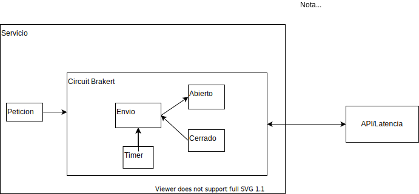

## 1. Descripcion:

Se plantea desarrollar un microservicio, que se capaz
de solucionar la latencia que se presenta al consumir el API
que emula una consulta.

Para esto el microservicio se desarrollara pensando en patrón circuit braker, el cual permite
configurar un tiempo para hacer el reitento de llamadas. Este patrón nos permitirá indentificar
cuando el api este disponible o no, para hacer el llamada a las peticiones y garantizar que el
servicio no se colapce y se logren procesar la mayoria de peticiones.

## 2. Drivers:

**Disponibilidad:** El sistema debe garantizar que el servicio mantenga alta disponibilidad, procese la mayoría de peticiones y controle la latencia del Api.

**Rendimiento:** El sistema debe responder de manera eficiente sobre las llamadas que se realizan al Api que emula una consulta, teniendo en cuenta que las respuestas tienen un tiempo en que están activas.

**Throughput:** El sistema debe poder manejar una alta cantidad de peticiones y responder de manera positiva a la mayoría de peticiones.

## 3. Diagrama:

